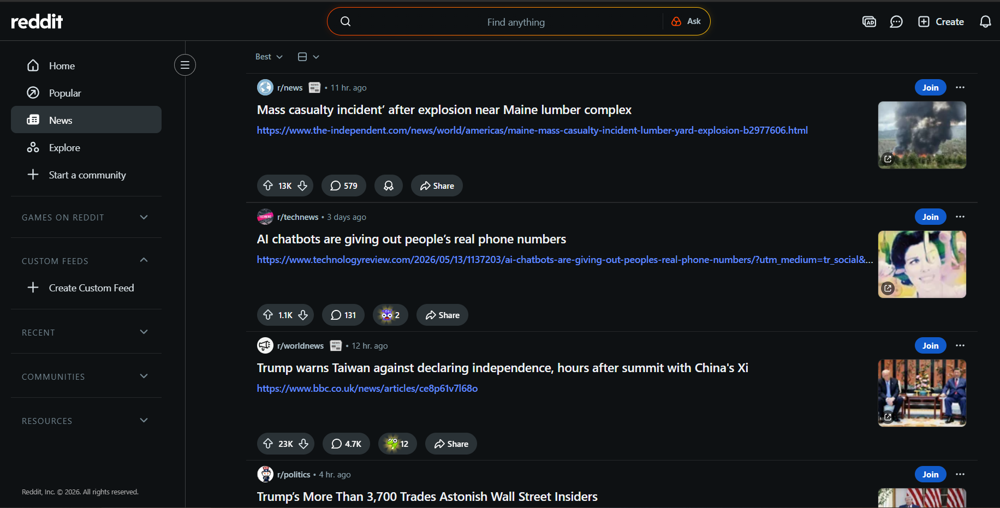

## I. The Triviality Of Titans

Have you ever stopped to look at how *simple* some of the most popular sites on the internet actually are? Take Reddit for example:

It's features (excluding the *insufferable amount* of random noise) consist of: 
* Serving you popular posts from "subreddits", a categorization system which still holds the medal for the worst way to organize content ever conceived.
* Comments on each of those posts, also sorted by votes.
* A Karma system, for signaling to others that you're way smarter and funnier than them

Doesn't the above sound like something a CS student could recreate in less than a week? The database schema for it would only take a handful of tables. You've got users, posts, comments, votes, and some metadata. Even a (moderately skilled) 12-year-old could easily vibecode the entire experience and probably design a better UI while they're at it.

Yet Reddit remains one of the most popular websites in the world, even after willingly dragging itself through the mud of enshittification and userbase alienation. Why?

## II. The Illusion

This is one of those things that tons of people blindly "building software" today do not get. They look at successful products and assume they understand what they are looking at. Simply coding something up is not difficult. It has *never* been the hard part relative to actually developing a successful software product.

Reddit was founded in 2005 with a unique premise ("the front page of the internet") that hadn't quite been executed that way before. It launched with funding from [Y Combinator](https://en.wikipedia.org/wiki/Y_Combinator_(company)) and hundreds of fake user accounts orchestrated by the founders to make the site look less dead at launch[^1].

> A platform that can be summarized as "Reddit but with prettier fonts and a better sorting algorithm" will **never** catch up. It lacks the single feature that cannot be simply built over a short amount of time. It is completely unrelated to software and it is called "the userbase".

If you listed every single Reddit clone currently in existence, the list would scroll for days. I can guarantee that every single one of them has a diminishingly low user count.

You can hold whatever opinion you want about the *quality* of Reddit's userbase, but it is undeniable that people go there because they know that the content is already there. They know there are always random people in the comments going "uhm, akschually" on every popular post, at all hours of the day. That is the engine running Reddit and keeping it alive. A platform is only as good as its userbase, because it is essentially the users' unpaid job to create the content and moderate it. 

The only thing that will push people away from platforms that can only be described as *established garbage* is force. Intentional, annoying force that is impossible to ignore. Until a platform becomes completely unusable, no alternative, doesn't matter how shiny it is, will stand a chance against it.

## III. The Cat Piss Restaurant

There's a restaurant in your city where all the interesting people go on Tuesday nights. 

The restaurant is not notable in any way. The food is mediocre, the decor hasn't been updated since 2009, and the bathroom smells suspiciously like cat piss. The only interesting thing about this establishment is that *all the interesting people go there*. You go there because, as an interesting person, you want to meet other interesting people. There are about 150 individuals exactly like you who tolerate the smell in the bathroom for the exact same reason.

Right across the street, there is another restaurant. Practically empty. They have far better drinks, cozy decor, and a staff that doesn't look like they're cutting phone batteries open out back. 

But they are no match for the trashy restaurant. Why? Because all the interesting people have arbitrarily picked the crap restaurant, and humans are comically terrible at developing effective workflows for coordinated switching. Everyone *knows* they are at a crap restaurant, but nobody wants to be the first idiot sitting alone across the street.

Now, imagine everyone could just summon a fully kitted-out restaurant out of thin air, on-demand, for free. The result? Hundreds of completely soulless restaurants, literally. Not a single person in most of them. Making the "building" part free doesn't solve the coordination problem. Because a truly successful restaurant isn't made by the physical restaurant itself. They're made by things that I touched on in the previous chapter, which take years to develop. 

If anything, it makes it vastly harder. Now you have two thousand competitors all desperately fighting for access to the exact same pool of people. Does this sound familiar? *(Hint: vibe-choding).*

## IV. Waiting For The Ship To Sink

Now that we've established the futility of trying to beat mediocre-but-established platforms, what can actually be done?

Let's say Discord suddenly decided to do something *really bad and unacceptable* that enraged the entire userbase. In theory, people would organize a coordinated switch to whatever the closest alternative is. 

This technically already happened when Discord introduced an extremely flawed age verification system. The closest alternative at the time was Revolt, which received a massive, sudden influx of users during the situation. But using Discord today doesn't feel any different, and everyone I know is still exactly where they were. People caught up in the switching craze just put "Revolt: @username" in their Discord bio and never actually stopped using Discord.

> For alternatives to truly flourish, the incumbent needs to fuck up the platform *so badly* that it becomes physically unusable for the vast majority of its users. 

Your alternative needs to be on standby, fully functioning, waiting in the dark shadows of bullshit, for that exact moment. But obviously, this doesn't happen very often. Most people do not give a shit enough to click a different icon on their screen.

An interesting case study here is Twitter. People finally started bleeding from the platform[^2], and for good reason. Open networks like Mastodon (And Bluesky, blegh)[^3] positioned themselves as viable alternatives that could handle the demand. As Twitter slowly dies from what can only be described as tumor asphyxiation[^4], these standby platforms will eventually act as lifeboats.

You can build a better version of Hacker News in less than a day. Nobody will use it, including you.

[^1]: https://arstechnica.com/information-technology/2012/06/reddit-founders-made-hundreds-of-fake-profiles-so-site-looked-popular/
[^2]: https://cybernews.com/tech/erman-politicians-x/ and https://futurism.com/future-society/twitter-x-elon-musk-stagnation
[^3]: https://mastodon.online/@mastodonmigration/116312883173526888
[^4]: https://en.wikipedia.org/wiki/Tumor_hypoxia